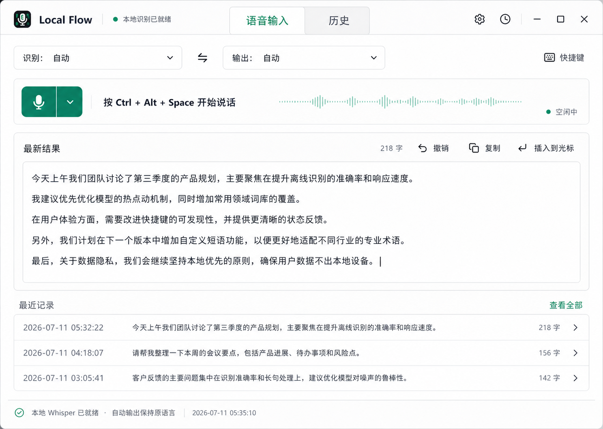

# Local Flow Windows UI V3 Design

## Goal

Turn the working Windows build into a focused daily dictation product. The normal path must be visible without scrolling: confirm language behavior, start dictation, review the latest text, copy or insert it, and reuse a recent result.

This phase changes the Windows main window and settings experience. It preserves the existing Electron, local Whisper, MyMemory, Qwen/Ollama, global shortcut, native input hook, tray, HUD, history, and packaging architecture.

## Approved Visual Target

The user approved a synthesis of the first and third visual directions:

The image is a hierarchy and interaction target, not a bitmap to embed in the product. All production labels remain localized HTML controls.

## Product Principles

- The app is an input utility, not a model control panel.
- Dictation is the single primary action.
- The first viewport must show readiness, language behavior, record control, latest result, and recent history.
- Provider and model details stay out of the main workflow unless attention is required.
- The global shortcut and HUD remain the fastest daily path; the main window is for review, reuse, and configuration.
- Automatic output continues to preserve the recognized language.

## Main Window

### Native Header

Use a compact 64 px header with:

- Local Flow icon and product name;
- a small readiness dot and short localized health label;
- renderer-owned `Dictation` and `History` tabs;
- icon-only Settings and History shortcuts with tooltips and accessible labels;
- standard Windows minimize, maximize, and close controls.

Remove the default Electron application menu from the product window. Tray menus remain unchanged.

### Dictation Tab

The dictation tab is a single vertical work surface.

1. **Language row**
   - Recognition and output language selects appear on one row.
   - Changing either select saves immediately.
   - `Auto` output is described as same-language output, never as implicit English translation.

2. **Voice command strip**
   - Replace the oversized record orb with a compact microphone button.
   - Show the active shortcut beside the button.
   - Show waveform-style activity feedback and a short state label.
   - Map existing phases to visible states: idle, starting, recording, stopping, transcribing, pasting, done, warning, and error.
   - Keep the existing recovery action directly below the strip only when intervention is required.

3. **Latest result editor**
   - Keep the latest result editable.
   - Show character count and actions for restore, copy, and insert at cursor.
   - Restore returns the editor to the most recently produced or selected history text after local edits.
   - Copy uses the existing clipboard fallback.
   - Insert hides the main window, returns focus to the previous application, and pastes the edited text through the existing Windows paste pipeline.
   - Edited text is ephemeral; this phase does not rewrite stored history entries.

4. **Recent history**
   - Show the three newest usable entries as one grouped list with row separators.
   - A row exposes timestamp, a single-line preview, character count, and a disclosure icon.
   - Selecting a row loads its text into the latest result editor without changing persistent history.
   - `View all` switches to the History tab.

5. **Footer health line**
   - Show one concise provider summary such as `Local Whisper ready - Auto output keeps the source language`.
   - Never show executable paths, model paths, download URLs, raw process errors, or stack traces here.

### History Tab

The History tab uses the same window rather than opening another page.

- Show all retained history entries as a compact list.
- Selecting an entry loads it into the result editor and returns to Dictation.
- Each entry supports copy and insert actions.
- Empty and failed-result states use localized explanatory copy.
- History deletion, search, tags, and cloud sync are outside this phase.

## Settings Information Architecture

Keep the existing settings drawer, but restructure it into four sections with a sticky header and sticky save footer:

1. **General**
   - interface language;
   - processing mode;
   - automatic paste;
   - personal dictionary;
   - startup and tray behavior.

2. **Shortcuts**
   - dictation shortcut recorder;
   - toggle versus hold mode;
   - paste-last shortcut recorder;
   - pause global shortcuts.

3. **Models and privacy**
   - microphone, Whisper, and text-provider health summaries;
   - install, retry, cancel, and diagnostic actions only when relevant;
   - clear local/cloud processing disclosure;
   - Qwen remains optional when MyMemory is selected.

4. **Advanced**
   - local executable and model paths;
   - Ollama endpoint and model;
   - download and mirror URLs;
   - raw setup output.

Advanced content is collapsed by default. It must not appear in the normal setup path.

The drawer is `min(560px, 100vw)`, traps focus while open, closes with Escape or the backdrop, restores focus to the Settings button, and never introduces page-level horizontal scrolling.

## Interaction And Data Flow

- `currentSettings`, provider status, setup status, history, and dictation status remain the renderer sources of truth.
- Home language changes call the existing settings IPC with a partial patch and refresh provider readiness.
- Renderer tabs are local UI state; they do not add routes or windows.
- The latest result editor keeps `baselineText` and `currentText` so restore and dirty state are deterministic.
- Add a narrow main-process IPC for inserting renderer-provided text. It accepts only a bounded string from the main renderer, hides the main window, waits briefly for Windows focus restoration, then calls the existing `pasteText` function.
- Paste failure preserves the text in the clipboard and reports a mapped warning without exposing diagnostics.
- Existing global shortcut, hold-to-dictate, Mouse4/Mouse5, tray, HUD, auto-paste, and paste-last behavior must not regress.

## Visual System

- Typography: Segoe UI and system fallbacks; 14-16 px body baseline.
- Page background: cool neutral `#F6F8F7`.
- Main surface: `#FFFFFF`.
- Primary text: `#17211E`.
- Muted text: `#66716D`.
- Divider: `#DCE3E0`.
- Ready/accent: `#078A68`.
- Recording only: `#D64B3C`.
- Warning: `#A96F16`.
- Error: `#B83A3A`.
- Border radius: 6 px for controls and 8 px maximum for framed surfaces.
- No gradients, decorative blobs, nested cards, oversized type, or giant circular controls.
- Use a locally packaged Lucide icon library for familiar actions. Do not hand-draw SVG icons. Every icon-only button has a tooltip and accessible name.

## Responsive Behavior

- At the normal 980 x 720 window, the complete daily workflow fits without horizontal scrolling and without hiding the record control below the fold.
- At widths from 760 to 919 px, language controls wrap, waveform width contracts, and secondary action labels become icon-only with tooltips.
- At heights below 650 px, the editor becomes shorter and recent history shows two rows; controlled vertical scrolling is allowed inside the content area.
- The settings drawer occupies the full width at narrow sizes.
- Dynamic and localized text must wrap or truncate intentionally; controls keep stable dimensions during state changes.

## Accessibility

- Use semantic buttons, tabs, lists, labels, status regions, and editable text.
- Tabs support arrow-key navigation and expose selected state.
- All actions are keyboard reachable and show a visible focus ring.
- State is communicated by text and icon as well as color.
- Live status announcements are concise and do not repeatedly announce waveform animation.
- Icon-only controls include localized `aria-label` text and hover/focus tooltips.
- The design must remain usable at 200% browser zoom within the supported minimum window.

## Error Handling

- Missing Whisper blocks recording with one recovery action, not a setup dashboard.
- Missing optional Qwen does not block same-language dictation or MyMemory target output.
- Target-language provider failures preserve the raw transcript and expose a safe retry or Auto-output recovery action.
- Paste failures preserve clipboard text and keep the editable result visible.
- Raw paths, spawn errors, setup commands, and provider diagnostics appear only in Advanced diagnostics.

## Non-Goals

- Real-time streaming transcription.
- New ASR or text providers.
- Qwen runtime stabilization beyond presenting its current setup state safely.
- iPhone UI changes.
- Dark mode.
- History deletion, search, tags, or cloud sync.
- Changes to native shortcut registration semantics.

## Test And Acceptance Strategy

- Add focused renderer view-model tests for tabs, recent-history projection, editor dirty/restore state, phase labels, and responsive action labels.
- Add markup and localization tests for the new hierarchy, settings sections, tooltips, and supported languages.
- Add preload/main-process tests for bounded insert-at-cursor IPC and paste-failure recovery.
- Extend the Electron app smoke test to cover tab switching, language autosave, result restore, history selection, settings section switching, and drawer focus behavior.
- Run the full unit suite, app smoke, microphone smoke, Windows package build, packaged smoke, product readiness, and release verification.
- Capture the implemented 980 x 720 Dictation view, History view, Settings General view, and Settings Advanced view.
- Compare the Dictation screenshot against the approved visual target at the same viewport and fix hierarchy, spacing, overflow, typography, and state-control mismatches before release.

## Acceptance Criteria

- Recording is visible and actionable in the first viewport.
- No horizontal scrollbar appears at 980 x 720 or 760 x 560.
- The main screen contains no model paths, download URLs, install logs, or provider diagnostics.
- Auto output visibly promises same-language behavior.
- Latest text can be edited, restored, copied, and inserted.
- Recent history can be reused without opening settings.
- Advanced settings are hidden by default.
- Every visible control works in the core flow.
- Existing Windows shortcut, microphone, provider, history, tray, HUD, and installer tests remain green.
