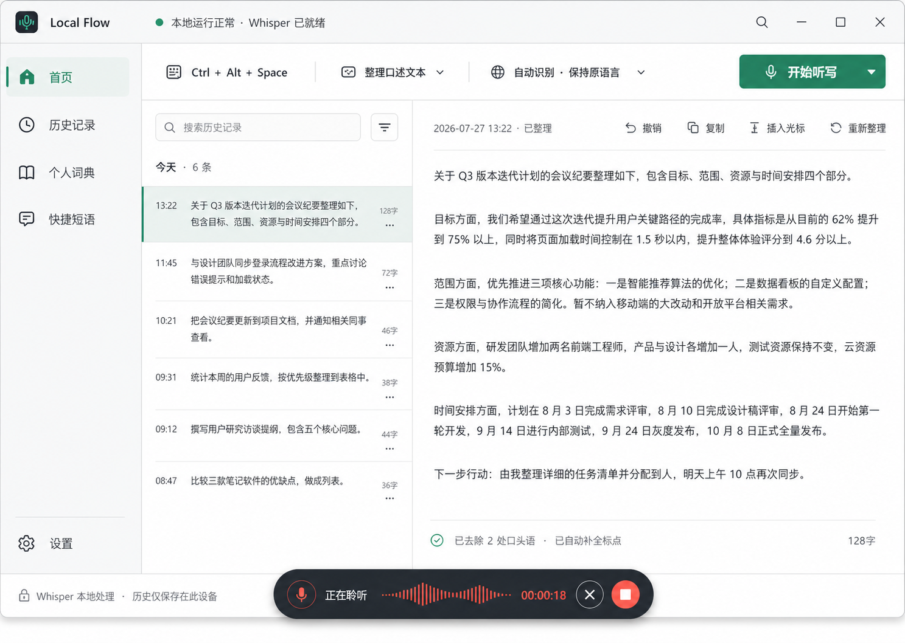

# Local Flow Windows UI V4 与启动可靠性设计

## 目标

把当前可运行但像测试面板的 Windows 版本升级为可长期驻留后台的语音输入产品，并修复“程序已经启动但用户看不到窗口”的启动体验。

本轮同时交付：

- 可靠的单实例启动、桌面快捷方式唤回和托盘行为；
- 方案 1 与方案 3 的精简融合主界面；
- 可搜索、可选择、可编辑和可复用的听写历史；
- 独立的个人词典与快捷短语管理；
- 更接近成熟语音输入产品的录音 HUD；
- 不破坏现有 Whisper、Qwen、MyMemory、语言、快捷键、自动粘贴和打包链路。

确认的视觉目标：

目标图用于确定层级、密度和状态表达。正式产品仍使用本地化 HTML、CSS 和 Lucide 图标，不把图片作为界面背景。

## 产品原则

- Local Flow 是跨应用输入层，不是翻译器、录音网页或模型控制台。
- 日常输入发生在目标应用中，通过全局快捷键、托盘和 HUD 完成。
- 主窗口负责历史、编辑、词典、快捷短语和设置。
- 自动输出保持识别出的原始语言；选择目标语言时才进行转换。
- Whisper 是默认本地语音识别路径；Qwen3 是可选文本处理能力，不得阻塞同语听写。
- 正常页面不得展示可执行文件路径、下载 URL、进程错误或模型安装日志。
- 所有可见导航和操作必须真正可用，不能只做视觉占位。

## 启动可靠性

### 单实例

主进程必须在 `app.whenReady()` 之前获取 Electron 单实例锁。

- 首个实例持有锁并继续初始化。
- 后续普通启动不再创建第二套窗口、托盘、快捷键和原生输入钩子，而是唤回现有主窗口。
- 后续带 `--hidden` 的登录启动不能把用户正在使用的窗口强制前置。
- 主实例退出后，下一次启动可以正常获取锁。

### 手动启动与登录启动

`startMinimizedToTray` 只决定 Windows 登录项是否携带 `--hidden`。

- 用户点击桌面、开始菜单或安装目录中的 Local Flow 时，主窗口必须显示。
- 只有命令行明确包含 `--hidden` 时才允许隐藏启动。
- 不能因为设置中启用了“登录后最小化到托盘”，导致后续手动启动也没有窗口。

### 主窗口显示

窗口显示不能只依赖一次 `ready-to-show` 事件。

- `ready-to-show` 是首选显示时机。
- `did-finish-load` 作为幂等回退路径。
- 两个事件都调用同一个 `revealMainWindow()`，确保只显示一次。
- 加载失败时显示用户可理解的本地错误对话框，并保留托盘退出入口，不能静默驻留。
- 唤回时先恢复最小化窗口，再显示并聚焦。

### 关闭到托盘

- 点击窗口关闭按钮继续隐藏到托盘，不退出输入服务。
- 每个运行会话第一次关闭时，通过托盘气泡说明“Local Flow 仍在后台运行，可再次点击桌面快捷方式或托盘图标打开”。
- 托盘单击、“打开 Local Flow”和再次运行桌面快捷方式都必须唤回同一个窗口。
- “退出”必须释放全局快捷键、原生钩子、HUD 和托盘资源。

## 主窗口信息架构

### 窗口

- 默认外窗尺寸：`1180 x 800`。
- 最小外窗尺寸：`780 x 600`。
- 使用标准 Windows 系统标题栏行为；产品内部顶部栏承载品牌、健康状态和搜索。
- 页面不得产生横向滚动。

### 左侧导航

固定导航项：

1. 首页
2. 历史记录
3. 个人词典
4. 快捷短语
5. 设置

侧栏使用浅冷灰背景和单一翠绿色选中状态。正常宽度显示图标与文字；窄窗口压缩为图标栏，所有图标提供本地化工具提示与无障碍名称。

### 顶部状态

顶部仅显示：

- Local Flow 品牌；
- “本地运行正常 · Whisper 已就绪”或对应的安全恢复状态；
- 搜索入口。

最小化、最大化和关闭继续由原生 Windows 标题栏提供，产品内部顶部栏不重复绘制窗口控件。

不得在顶部同时展示 Qwen、MyMemory、模型路径或下载状态。

### 命令条

首页和历史记录共用稳定命令条：

- 当前全局快捷键；
- 文本处理模式；
- 语言行为；
- “开始听写”主操作。

命令条使用对齐和分隔线组织，不把每个值做成独立卡片。

## 首页与历史工作区

### 双栏结构

主工作区在宽度不小于 900 CSS px 时使用稳定双栏：

- 左栏约 44%，负责搜索和历史列表；
- 右栏约 56%，负责当前结果或选中记录的编辑；
- 两栏之间使用单一分隔线。

在 900-999 CSS px 时，侧栏压缩为图标栏，历史栏保持至少 280px，操作按钮只显示图标和工具提示。

小于 900 CSS px 或 200% 缩放触发窄屏布局时，工作区改为主从切换：

- 默认显示历史列表；
- 选择记录后以完整工作区显示编辑器；
- 编辑器顶部提供明确的“返回历史”按钮；
- 切换只改变视图，不清除搜索、选择或未保存编辑状态。

### 历史列表

- 支持按文本内容实时搜索。
- 按“今天”“昨天”和日期分组。
- 每行显示时间、最多两行文本预览、字符数和更多操作。
- 失败记录显示安全解释和重试入口，不展示底层进程错误。
- 选择一行后在右侧打开，不跳转新窗口。
- 行与行之间使用分隔线，不使用独立卡片。

### 编辑工作区

- 最新结果和历史记录使用同一编辑器。
- 显示创建时间、处理状态和字符数。
- 支持撤销到最近一次已保存文本。
- 支持复制。
- 支持插入到先前光标位置。
- 支持重新整理。
- 编辑在短延迟后自动保存到对应历史记录；显示“已保存”或安全的保存失败状态。
- 没有选中记录时显示最新成功听写；没有历史时显示简洁空状态。

### 重新整理

- 重新整理使用记录保存的原始转写作为输入，避免对已经整理过的文本反复改写。
- 使用当前处理模式、词典和文本提供方。
- 成功后更新该记录的显示文本，但保留原始转写。
- 失败时保留现有文本并显示可重试状态。
- Qwen 缺失时，同语本地整理可使用现有规则路径；目标语言转换可按配置回退到 MyMemory。

## 个人词典

- 独立页面显示词条列表、搜索和添加入口。
- 支持添加、编辑和删除。
- 去除空白、重复词条和纯空格内容。
- 修改后立即保存并用于后续文本整理。
- 设置页不再显示大段词典文本框，只提供“管理个人词典”入口。

## 快捷短语

每条快捷短语包含：

- 唤起短语；
- 展开文本；
- 稳定 ID。

页面支持搜索、添加、编辑、删除和复制。

首版展开规则：

- 只在完整原始转写与唤起短语规范化后完全匹配时展开；
- 不在长句内部做模糊替换，避免误触发；
- 命中后直接使用短语文本进入粘贴与历史保存；
- 历史记录标记为快捷短语展开，但主界面不显示技术标签。

## 录音 HUD

### 尺寸与层级

- 默认约 `460 x 72`，始终位于当前屏幕工作区底部中央。
- 仅在开始、录音、停止、转写、粘贴、完成、警告和错误状态显示。
- 不抢夺目标应用焦点，不进入任务栏。
- 只有 HUD 使用功能性胶囊轮廓和轻量阴影。

### 状态

- 开始：准备麦克风。
- 录音：波形、计时、取消和停止。
- 转写：进度动画和“正在转写”。
- 整理：进度动画和“正在整理”。
- 粘贴：显示“正在插入”。
- 完成：短暂显示成功并自动隐藏。
- 警告与错误：显示简短恢复文案和打开主窗口入口。

### 操作

- 停止按钮结束录音并进入转写。
- 取消按钮丢弃本次录音并恢复空闲状态，不创建历史记录。
- `Escape` 在录音期间等同取消。
- 所有 HUD IPC 必须验证发送者来自 HUD 窗口。

## 设置

点击侧栏“设置”后打开固定宽度不超过 560px 的右侧设置抽屉，保留当前页面与选择状态。抽屉只保留四组：

1. 常规：界面语言、处理模式、自动粘贴、开机启动、登录隐藏启动。
2. 快捷键：听写、按住说话、粘贴上一段、暂停快捷键。
3. 模型与隐私：麦克风、Whisper、文本提供方、Qwen 可选安装和本地/云端说明。
4. 高级：路径、下载源、Ollama 和诊断日志。

高级分区默认折叠。模型安装失败不得污染首页或历史编辑器。

## 分阶段交付

本设计作为一个 Windows V4 版本验收，但实现按四个可独立验证的增量推进，避免一次性替换全部链路：

1. 启动基础：单实例、手动可见启动、登录隐藏启动、托盘唤回和加载失败恢复。
2. 数据与动作：历史更新、重新整理、词典规范化、快捷短语与受控 IPC。
3. 主窗口：侧栏、命令条、历史搜索、响应式主从工作区、编辑自动保存和设置抽屉。
4. 输入体验：HUD 取消与停止、完整状态投影、打包后启动验证和视觉回归。

每个增量完成后必须通过对应单元测试和应用冒烟测试；上一增量未稳定时不进入下一增量。只有四个增量和发布验证全部通过后才生成交付安装包。

## 数据与模块边界

### 渲染进程

- 导航、搜索、分组、选择、编辑状态和表单交互由渲染进程负责。
- 视图模型函数保持纯函数，便于单元测试。
- 编辑自动保存使用串行队列和版本号，旧请求不能覆盖新文本。

### 主进程

- 主进程负责单实例、窗口、托盘、全局快捷键、HUD、模型调用、历史持久化和插入文本。
- 新增的历史更新、重新整理和 HUD 操作 IPC 必须验证发送者。
- 文本长度、短语长度和集合数量必须有上限。

### 设置与历史

- `settings.json` 增加规范化后的 `snippets`。
- `history.json` 继续保留 `transcript` 和 `text`，并允许更新 `text`、处理状态和修改时间。
- 写入操作串行执行，使用临时文件与替换写避免部分 JSON。
- 现有历史和设置自动向前兼容，不要求用户迁移或清空数据。

## 错误处理

- 重复启动：唤回现有窗口。
- 主窗口加载失败：显示本地错误对话框和退出选项。
- 麦克风失败：HUD 与主窗口显示授权或设备恢复动作。
- Whisper 缺失：阻止录音并提供安装入口。
- Qwen 缺失：只禁用依赖 Qwen 的路径，不阻止基础听写。
- 自动保存失败：保留编辑内容并提供重试。
- 插入失败：文本保留在剪贴板和编辑器中。
- 快捷短语展开失败：保留原始转写。

## 视觉系统

- 页面背景：`#F5F7F6`。
- 主表面：`#FFFFFF`。
- 侧栏：`#F0F3F2`。
- 主要文字：`#17211E`。
- 次要文字：`#66716D`。
- 分隔线：`#DCE3E0`。
- 主强调：`#078A68`。
- 录音：`#E2554F`。
- 警告：`#A96F16`。
- 错误：`#B83A3A`。
- 焦点：`#1769E0`。
- 控件圆角 4-6px，独立表面最多 8px，HUD 可使用胶囊轮廓。
- 禁止渐变、装饰光斑、紫色主调、深蓝主调、嵌套卡片和超大标题。
- 字体使用 Segoe UI、Microsoft YaHei 和系统后备字体。

## 无障碍

- 导航使用语义化 `nav` 和当前页面状态。
- 历史列表和编辑器具有明确名称、选中状态和键盘操作。
- 图标按钮均有本地化 `aria-label` 和工具提示。
- 设置抽屉维持焦点陷阱、Escape 关闭和关闭后焦点恢复。
- HUD 状态使用简短实时区域，不重复播报波形。
- 状态不能只依赖颜色。
- 200% 缩放与最小窗口下自动使用主从切换，仍可完成搜索、选择、编辑、复制和插入。

## 测试策略

### 单元测试

- 手动启动、登录隐藏启动和二次启动策略。
- 单实例事件的显示决策。
- 历史分组、搜索、选择和更新。
- 编辑自动保存的版本与串行行为。
- 词典和快捷短语规范化。
- 快捷短语完整匹配展开。
- 重新整理的原始转写选择与失败保留。
- HUD 取消、停止和状态投影。

### Electron 应用测试

- 正常启动后主窗口可见。
- 第二次启动不增加完整应用实例并唤回主窗口。
- `--hidden` 启动保持后台。
- 关闭到托盘后再次运行可唤回。
- 导航五个入口全部可用。
- 历史搜索、选择、编辑、自动保存、复制、插入和重新整理。
- 词典与快捷短语增删改。
- HUD 停止、取消和 Escape。
- 不泄露路径、URL、spawn、ENOENT 或 stderr。

### 发布验证

- 完整单元测试。
- 应用冒烟测试。
- 麦克风冒烟测试。
- 可见启动与隐藏启动测试。
- Windows 打包。
- 打包后启动、二次启动和托盘唤回测试。
- 产品就绪检查和发布文件校验。
- 1180 x 800 双栏、980 x 720 紧凑双栏、780 x 600 主从列表和编辑器三组尺寸的视觉截图。
- 主界面与确认目标图并排比较，修复层级、密度、间距、溢出和状态差异。

## 验收标准

- 点击桌面或开始菜单中的 Local Flow 必须出现主窗口。
- 重复点击启动入口只保留一个应用实例，并唤回现有窗口。
- 登录隐藏启动不打扰用户，手动启动不受该设置影响。
- 首页不再像模型或录音测试面板。
- 主窗口具备可用的侧栏、历史搜索、宽屏双栏编辑、窄屏主从切换、词典、快捷短语和设置抽屉。
- 编辑、复制、插入、重新整理和自动保存都能完成真实操作。
- HUD 在录音期间提供可用的取消与停止。
- 自动语言保持原语种。
- Whisper 本地路径继续可用，Qwen 仍为可选项。
- 现有历史、设置、托盘、快捷键、原生输入钩子、安装脚本和发布流程不回归。

## 非目标

- 本轮不实现云账户、跨设备同步、团队空间、订阅、统计看板或应用上下文风格学习。
- 本轮不修改 iPhone 界面。
- 本轮不新增付费 API 依赖。
- 本轮不实现模糊短语触发或长句内部文本宏替换。
- 本轮不更换 Whisper 或 Qwen 模型系列。
